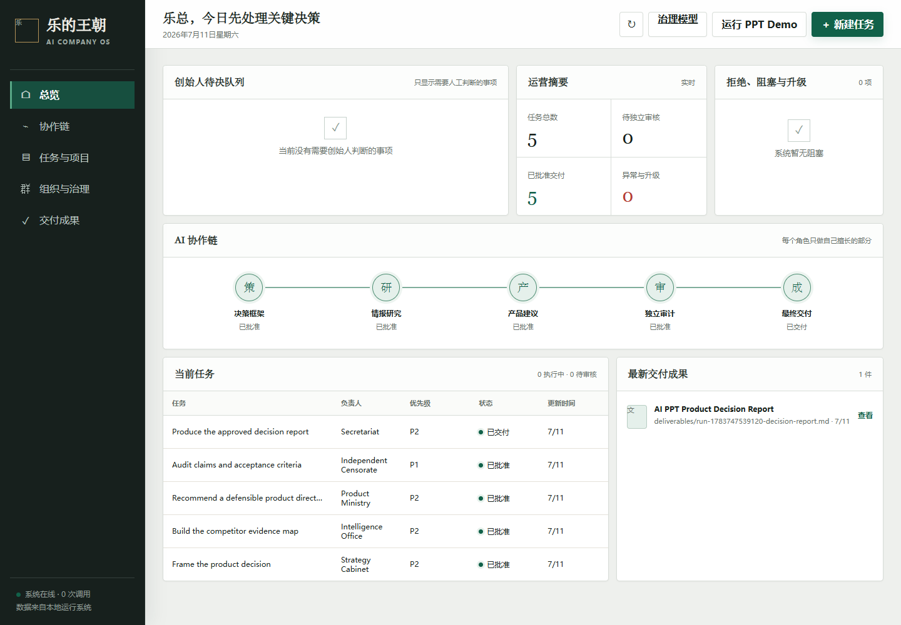
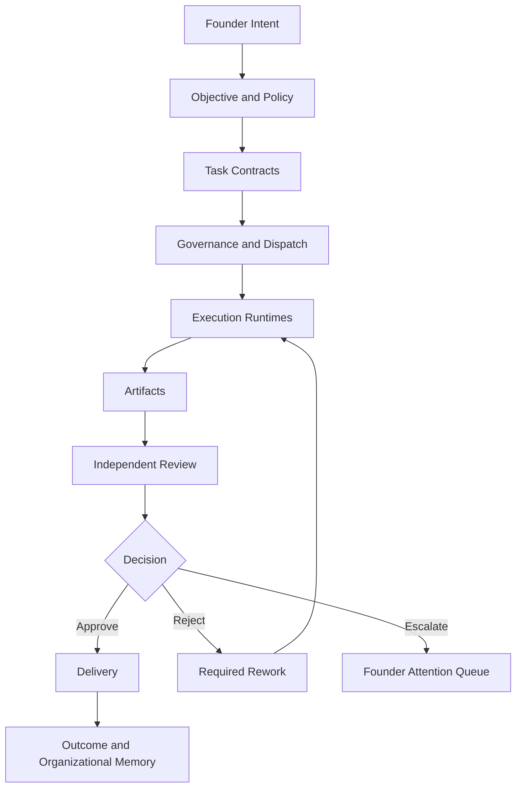

# Le Dynasty OS

> **An organizational control plane for accountable AI work.**

[](#what-exists-today)
[](docs/MATURITY-MODEL.md)
[](#quick-start)
[](LICENSE)

Agent runtimes make models execute. Le Dynasty OS explores the layer above execution: who owns the work, what an executor may do, which artifact must be produced, who can approve or reject it, when a human must intervene, and what the accepted outcome cost.

The system is centered on **Accountable Work**, not Agent activity. An executor is a replaceable resource. It may be an LLM, script, human, browser agent, coding agent, automation, or external service.



## The problem

Model capability is becoming easier to access. Organizational capability is not.

More Agents do not automatically create responsibility. More messages do not create delivery. Self-evaluation is not independent review. Token totals are not cost governance. Stored conversation is not organizational memory.

A one-person company needs more than orchestration. It needs a way to allocate responsibility, constrain authority, review work independently, accept or reject artifacts, escalate abnormal decisions, and preserve only useful learning.

The founder's attention is the scarce resource:

> The system should maximize useful output per unit of founder attention.

## The new category

Le Dynasty OS is not another Agent execution framework. It is a proposed **governance operating layer for accountable AI organizations**.

```text
Agent frameworks answer:  How can Agents run and collaborate?
Le Dynasty OS asks:       How should AI work be owned, governed, accepted, and learned from?
```

Its core operating rules are:

- one accountable owner per Task
- explicit input, output, responsibility, and acceptance Contracts
- proposal authority separated from approval authority
- execution authority separated from review authority
- rejection represented as an executable Decision
- work completed through accepted Artifacts, not transcripts
- human attention reserved for material decisions and escalations

The Dynasty identity is a memorable metaphor for modern operating functions. It does not replace the governance model with role-play.

## How it works



Three layers remain deliberately separate:

```text
Le Dynasty OS
  Governance, ownership, contracts, review, permissions, escalation

Agent Runtimes
  LangGraph, CrewAI, AutoGen, OpenAI Agents SDK, or custom workers

Models and Tools
  LLMs, APIs, code execution, browsers, media, and external systems
```

## A real governance run

The included AI PPT product decision demo executes five accountable stages:

```text
Decision framing
  -> evidence map
  -> product recommendation
  -> independent rejection
  -> one controlled rework
  -> approval
  -> delivered Markdown decision memo
```

Each Task has one assignee and a structured Contract. The Product Task is reviewed by a separate auditor. The rejection identifies a failed acceptance criterion, reason code, and required actions. The final Artifact is written to disk.

This workflow is explicitly labeled:

```text
workflowType: reference
domain: product_decision
generality: fixed_demo
```

It is a reference implementation, not a general governance engine. See [Reference Workflow](docs/REFERENCE-WORKFLOW.md).

## What exists today

### Implemented Today

The repository currently runs and tests:

- a zero-dependency Node.js server
- a five-stage fixed reference workflow
- one accountable assignee per Task
- structured Task Contracts attached to tasks
- a separate auditor role
- a structured Review Decision for reject and approve outcomes
- explicit state history for Task transitions
- one fixed rejection and rework cycle
- a Markdown Artifact written to `deliverables/`
- SSE updates to the founder dashboard
- optional DeepSeek calls through an environment variable
- in-memory task, run, and token records
- an offline deterministic mode that requires no API key

### Concept Prototype

These concepts are demonstrated but simplified or hardcoded:

- separation of production and review
- acceptance criteria
- rejection as a first-class state
- founder attention queue
- artifact-centered completion
- Agent runtime replaceability
- workflow metadata and maturity boundaries

### Target Architecture

These concepts are design targets, not current production capabilities:

- generic policy-driven workflow definitions
- enforced permissions and authority
- dynamic capability-based assignment
- durable append-only event storage
- artifact versions and provenance
- provider pricing, budgets, and cost controls
- escalation policy
- reviewed organizational memory
- outcome measurement across workflows

## Concept-to-implementation map

| Concept | Current implementation | Limitation | Next step |
| --- | --- | --- | --- |
| Independent review | Fixed auditor stage | Auditor and sequence are hardcoded | Policy-selected independent reviewer |
| Review Decision | Structured reject and approve objects | Decision schema is not yet validated at API boundaries | Add JSON Schema validation |
| Rework | One fixed rework cycle | Rework count is hardcoded | Policy-driven retry and escalation |
| Task Contract | Structured Contract attached to every Task | Runtime uses only part of the Contract | Enforce inputs, outputs, and criteria |
| Task ownership | One assignee per Task | No dynamic team selection | Capability-based assignment |
| Task state | Named states plus in-memory state history | No generic transition policy | Explicit state machine and transition guards |
| Artifact delivery | Markdown written to disk | One artifact type, no versions | Versioned artifact store with provenance |
| Events | SSE updates | No durable replay | Append-only event store |
| Cost visibility | Calls and tokens in memory | Price and budgets are incomplete | Provider pricing and budget policy |
| Memory | Defined in concept documents | Not implemented | Outcome-linked reviewed memory |

## Positioning alongside Agent frameworks

Le Dynasty OS composes with mature runtimes instead of pretending to replace them.

| Project | Primary strength | Le Dynasty OS focus |
| --- | --- | --- |
| [LangGraph](https://langchain-ai.github.io/langgraph/reference/) | Durable, stateful Agent workflows | Organizational ownership, contracts, approval, and escalation |
| [CrewAI](https://docs.crewai.com/) | Role-based crews and structured flows | Authority boundaries, independent review, and accepted Artifacts |
| [Microsoft AutoGen](https://microsoft.github.io/autogen/stable/index.html) | Conversational and event-driven multi-Agent systems | Founder visibility and accountable delivery |
| [OpenAI Agents SDK](https://openai.github.io/openai-agents-python/agents/) | Tools, handoffs, guardrails, usage, and tracing | Business-level decisions, review queues, ownership, and outcomes |

## Governance primitives

The domain model uses a consistent vocabulary:

`Objective` -> `Task` -> `Contract` -> `Role` / `Agent` -> `Artifact` -> `Review` -> `Decision` -> `Outcome`

Cross-cutting controls include `Authority`, `Permission`, `Escalation`, `Event`, `Cost`, and `Memory`.

Important distinction:

> Prompt decides how an Agent responds. Contract decides whether the organization accepts the work.

See [Governance Primitives](docs/GOVERNANCE-PRIMITIVES.md) for definitions, fields, relationships, and examples.

## Dashboard

The dashboard is designed around founder decisions rather than Agent presence. It prioritizes:

- awaiting approval or independent review
- rejected work requiring rework
- blocked or escalated Tasks
- recent approved Artifacts
- workflow accountability chain
- operational usage signals

It intentionally avoids Agent avatar grids, activity theater, and chat bubbles.

## Quick start

Requires Node.js 18 or newer. There are no third-party runtime dependencies.

```bash
git clone https://github.com/xiangyule33-hub/le-dynasty-os.git
cd le-dynasty-os
npm start
```

Open `http://127.0.0.1:3456`, then select **Run PPT Demo**.

The offline run will execute five stages, reject once, rework once, approve, and write a Markdown report under `deliverables/`.

Run tests:

```bash
npm test
```

Optional DeepSeek mode:

```powershell
$env:DEEPSEEK_API_KEY="your_key_here"
npm start
```

The key is read from the environment and is never written to the project.

## Project documents

- [Concept](docs/CONCEPT.md): why accountable AI work needs a control plane
- [Governance Primitives](docs/GOVERNANCE-PRIMITIVES.md): the domain model
- [Maturity Model](docs/MATURITY-MODEL.md): levels 0-5 and the current Level 2.5 assessment
- [Reference Workflow](docs/REFERENCE-WORKFLOW.md): what the PPT demo proves and does not prove

## Roadmap

The next engineering sequence is intentionally narrow:

1. Validate Contract and Review Decision objects at API boundaries.
2. Replace fixed transitions with a policy-driven state machine.
3. Persist Events and Artifacts so runs can be replayed and audited.

Only after those foundations should the project add dynamic Agent teams, permissions, budgets, or organizational memory.

## Honest limitations

- The five roles and their order are hardcoded.
- Offline output is deterministic reference content, not live market research.
- DeepSeek mode does not provide web evidence retrieval.
- Rejection, rework, and approval are fixed to one cycle.
- Review explanation remains partly Markdown even though the Decision is structured.
- Tasks, runs, events, and usage are stored in memory.
- Events are streamed but not durably replayable.
- Token accounting is not cost governance.
- Permissions, escalation, memory, and outcome measurement are not implemented.
- The project is not a production-ready autonomous company runtime.

Current maturity: **Level 2.5 - workflow prototype with emerging role and governance primitives.**

## Contributing

Useful contributions improve accountability, traceability, or accepted output rather than increasing Agent count.

Good starting areas:

- Contract and Decision schemas
- transition policy and tests
- event persistence and replay
- artifact provenance
- permission models
- workflow evaluation metrics
- founder attention design

Open an issue describing the governance problem, proposed operating rule, and expected effect on delivery quality.

## License

[MIT](LICENSE)
