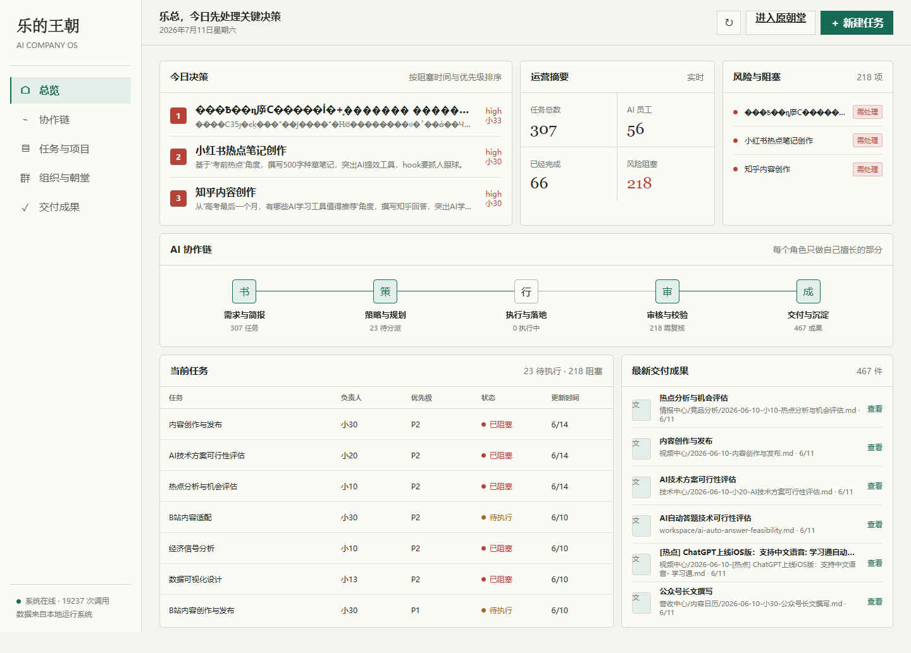

# Le Dynasty OS

> A governance and operations layer for running a one-person company with coordinated AI agents.

[](#project-status)
[](#quick-start)
[](LICENSE)

Le Dynasty OS is an open-source experiment in **AI organizational design**.

It asks a question that most multi-agent systems avoid: once a founder can call ten, fifty, or one hundred AI agents, how should those agents be organized so that they produce accountable work instead of duplicated opinions, endless conversations, and invisible token spend?

The project treats agents as an operating organization with explicit responsibilities, decision rights, handoffs, review gates, escalation paths, memory, cost controls, and measurable delivery. Its dynasty-inspired language makes the model memorable; its underlying structure maps directly to modern company operations.



## The Thesis

The limiting factor of an AI company is not the number of available models. It is the quality of coordination around them.

Giving every agent the same prompt creates parallel answers, not an organization. Letting agents debate without ownership creates activity, not progress. Saving every conversation creates storage, not institutional memory.

Le Dynasty OS is built around a different premise:

> AI agents become economically useful when responsibility, authority, review, and delivery are designed as carefully as the prompts themselves.

The founder should not manage dozens of chat windows. The founder should set objectives, approve consequential decisions, resolve escalations, and receive reviewed deliverables.

```text
Objective
   -> decision framing
   -> task decomposition
   -> specialist execution
   -> independent review
   -> founder approval
   -> delivery
   -> organizational learning
```

## Why Existing Multi-Agent Demos Fall Short

Many multi-agent projects demonstrate that several personas can talk to one another. That is interesting, but it leaves the operational questions unanswered:

- Who owns the final result?
- Which agent is allowed to make which decision?
- How is duplicated work prevented?
- What happens when agents disagree?
- Who reviews the agent that produced the work?
- When should a task be escalated to a human?
- Which memories are worth preserving?
- How much did the result cost to produce?
- Can the final artifact be inspected, revised, and reused?

Le Dynasty OS makes these questions part of the product instead of hiding them inside prompts.

## What Makes It Different

| Dimension | Persona-based agent demos | Le Dynasty OS |
| --- | --- | --- |
| Unit of work | Conversation | Traceable task and deliverable |
| Coordination | Agents talk in parallel | Agents follow owned handoffs |
| Authority | Usually implicit | Explicit decision rights |
| Quality control | Self-review or majority vote | Independent review and rejection |
| Human role | Participant in every chat | Objective owner and escalation authority |
| Memory | Conversation history | Reviewed organizational knowledge |
| Cost | Hidden model activity | Operational metric |
| Outcome | More text | Approved, reusable artifact |

## Positioning in the Agent Ecosystem

Le Dynasty OS is not trying to replace the strongest agent frameworks. It operates one level above them.

Frameworks such as [LangGraph](https://langchain-ai.github.io/langgraph/reference/), [CrewAI](https://docs.crewai.com/), [Microsoft AutoGen](https://microsoft.github.io/autogen/stable/index.html), and the [OpenAI Agents SDK](https://openai.github.io/openai-agents-python/agents/) provide increasingly capable foundations for executing, routing, observing, and scaling agents. Le Dynasty OS focuses on the organizational layer that decides **why those agents exist, who is accountable for their work, when humans must intervene, and what counts as an accepted business outcome**.

| Project | What it does especially well | Where Le Dynasty OS adds a different layer |
| --- | --- | --- |
| LangGraph | Durable, stateful, long-running agent workflows with persistence and human-in-the-loop control | Maps workflow state to organizational ownership, approval authority, escalation, and founder decisions |
| CrewAI | Role-based agent crews combined with structured flows, memory, guardrails, and task processes | Extends role assignment into an explicit governance system with independent audit, decision rights, and acceptance contracts |
| Microsoft AutoGen | Conversational and event-driven multi-agent applications with scalable agent runtimes | Reframes agent communication as a company operating model centered on tasks, reviewed artifacts, and management visibility |
| OpenAI Agents SDK | Lightweight agent execution with tools, handoffs, guardrails, usage tracking, and tracing | Turns execution traces and handoffs into executive-level signals: blockers, owners, review queues, cost, and delivery status |

The distinction can be expressed simply:

```text
Agent frameworks answer:  How can agents run and collaborate?
Le Dynasty OS asks:       How should an AI organization be governed and managed?
```

### Where Le Dynasty OS Is Strong

#### 1. It begins with the founder's attention

Most developer tools begin with graphs, runs, messages, or agent definitions. Le Dynasty OS begins with decisions requiring human judgment. The dashboard is organized around blocked work, approval queues, responsible owners, and deliverables rather than around agent activity for its own sake.

#### 2. It treats governance as product functionality

Roles are not only prompt personas. The model includes proposal rights, approval rights, execution responsibility, independent review, security vetoes, and escalation routes. This makes the organization legible to a non-technical founder.

#### 3. It separates production from judgment

An agent should not be able to create, approve, and publish the same artifact without an independent checkpoint. The Censorate and security functions make review and challenge visible parts of the workflow instead of optional prompt instructions.

#### 4. It measures work through deliverables

The center of the system is not the transcript. It is the artifact: a report, presentation, video package, implementation, analysis, or decision memo with an owner and acceptance criteria. Conversation is evidence; delivery is the outcome.

#### 5. It makes cultural design useful

The dynasty metaphor gives abstract AI governance a memorable mental model. Cabinet, Secretariat, Ministries, Censorate, Academy, and Observatory each communicate a distinct operating responsibility. The metaphor is constrained by modern workflow logic, so it improves comprehension instead of becoming a role-playing theme.

#### 6. It is designed for local-first, one-person operations

The intended user is not only an enterprise platform team. It is also a founder, designer, creator, consultant, or independent operator who needs a small number of AI systems to produce real work while retaining control of private files, costs, and final decisions.

### Designed to Compose, Not Compete

The long-term architecture can use mature runtimes underneath the governance layer:

```text
Le Dynasty OS
  -> governance, ownership, acceptance, escalation, executive interface

LangGraph / CrewAI / AutoGen / Agents SDK
  -> execution graphs, crews, messages, tools, handoffs, tracing

Model and tool providers
  -> reasoning, generation, retrieval, code, media, and external actions
```

This allows Le Dynasty OS to stay focused on its strongest idea: turning agent capability into an accountable operating organization.

## Governance Model

The dynasty vocabulary is a product metaphor, not decorative role-play. Each institution represents a durable operating function.

| Dynasty institution | Modern equivalent | Primary responsibility |
| --- | --- | --- |
| Emperor | Founder / CEO | Sets objectives and owns irreversible decisions |
| Cabinet | Decision support | Synthesizes proposals, tradeoffs, and recommendations |
| Secretariat | Chief of staff / operations | Decomposes goals, dispatches work, and tracks dependencies |
| Six Ministries | Functional departments | Execute product, engineering, growth, content, finance, and operations work |
| Censorate | Independent audit | Challenges weak assumptions and inspects failures |
| Imperial Guard | Security and permissions | Controls access, secrets, external actions, and operational risk |
| Hanlin Academy | Knowledge management | Maintains standards, reusable methods, and reviewed memory |
| Observatory | Data and intelligence | Monitors signals, measures outcomes, and supports forecasting |

This structure introduces three forms of control that agent swarms often lack:

1. **Separation of proposal and approval.** The agent recommending an action does not automatically authorize it.
2. **Separation of production and review.** The agent creating an artifact is not its sole judge.
3. **Independent escalation.** Audit and security roles can surface risks without reporting through the production role they inspect.

## AI Complementarity

More agents only help when they contribute different forms of judgment.

In Le Dynasty OS, complementarity is designed around professional constraints:

- **Product** asks whether the user need is real and worth solving.
- **Engineering** tests feasibility, dependencies, and implementation risk.
- **Design** protects comprehension, usability, and communication quality.
- **Data** verifies evidence, definitions, and measurement logic.
- **Finance** evaluates cost, return, and resource allocation.
- **Growth** tests distribution, positioning, and conversion assumptions.
- **Security** checks permissions, privacy, and external side effects.
- **Audit** searches for failure modes, contradictions, and unsupported confidence.
- **Operations** controls sequencing, ownership, deadlines, and escalation.

The objective is not artificial consensus. The objective is a result that has survived the right disagreements and still has a clear owner.

## Operating Protocol

Every production task should define four contracts before execution:

| Contract | Question it answers |
| --- | --- |
| Responsibility | Who owns the result? |
| Input | What evidence, files, and constraints may be used? |
| Output | What exact artifact must be delivered? |
| Acceptance | What conditions must be true before the task is complete? |

A task then moves through an explicit lifecycle:

```text
Proposed
  -> awaiting approval
  -> decomposed
  -> assigned
  -> in progress
  -> awaiting review
  -> approved / rejected
  -> delivered
  -> learned
```

Rejection is a first-class state. It should identify the failed acceptance criterion, the responsible role, and the next valid action. This prevents an agent from silently regenerating work until the result merely looks different.

## Product Experience

The dashboard is intentionally decision-first. It does not open with a wall of agent avatars. It opens with the information a founder needs to run the company:

- decisions requiring human judgment
- blocked work and responsible owners
- current position in the collaboration chain
- tasks in execution and awaiting review
- recent deliverables
- system connectivity and model usage

The current public interface includes:

- responsive desktop and mobile layouts
- decision queue ordered by priority and blockage
- operational task summary
- visible AI collaboration chain
- current task table
- deliverable review area
- real API mode
- standalone demo mode
- functional task creation in both modes
- local persistence for demo-created tasks
- real-time task refresh through WebSocket events

## System Architecture

```text
                        +--------------------+
                        | Founder Dashboard  |
                        +---------+----------+
                                  |
                  objectives, approvals, escalation
                                  |
                    +-------------v-------------+
                    | Governance and Dispatch   |
                    +------+------+-------------+
                           |      |
                 task plan |      | policy / permissions
                           |      |
              +------------v--+  +v----------------+
              | Agent Runtime |  | Audit & Safety  |
              +-------+-------+  +--------+--------+
                      |                   |
              specialist execution       | review / rejection
                      |                   |
              +-------v-------------------v-------+
              | Tasks, Events, and Deliverables  |
              +----------------+------------------+
                               |
                    reviewed organizational memory
```

The public prototype currently focuses on the founder dashboard and its backend contract. The private runtime is being separated from local memories, secrets, customer files, and experimental services before its orchestration components are published.

## Backend Contract

The dashboard automatically switches to live mode when the following endpoints are available:

```text
GET  /api/tasks          List enriched tasks
POST /api/tasks          Create and assign a task
GET  /api/agents         List agents and governance state
GET  /api/deliverables   List reviewable output artifacts
GET  /api/token-usage    Return model calls, tokens, and cost
WS   /                   Broadcast task lifecycle events
```

Example task shape:

```json
{
  "id": "T-0042",
  "title": "Validate the first public workflow",
  "description": "Run the workflow from objective to reviewed deliverable.",
  "priority": "P1",
  "status": "pending",
  "assignee": 14,
  "assigneeName": "Architecture",
  "createdAt": "2026-07-11T08:00:00.000Z"
}
```

## Quick Start

The public dashboard has no build step and no frontend dependencies.

### Standalone demo

Open `index.html` in a browser. The dashboard detects the local file protocol and enters demo mode automatically.

Tasks created in demo mode are stored in `localStorage`. No request is sent to an external service.

### Live integration

Serve `index.html` from the same origin as a compatible backend:

```text
http://localhost:3456/index.html
```

The dashboard will request the API contract above and subscribe to task events over WebSocket.

## Example Use Cases

### Product development

A founder submits a customer problem. Product validates the need, engineering checks feasibility, design prepares the interaction model, finance estimates cost, audit challenges the assumptions, and the founder approves implementation.

### Content and video production

Research identifies an opportunity, strategy defines the angle, writing creates the script, visual production generates assets, quality control rejects weak outputs, and distribution receives an approved package.

### Market intelligence

Data agents collect signals, an intelligence role compares sources, an analyst explains implications, audit checks evidence quality, and the founder receives a decision memo rather than a pile of links.

### Client delivery

Feedback becomes page-level or artifact-level tasks, specialists make controlled revisions, reviewers compare the result against acceptance criteria, and the final editable deliverable remains traceable to the original request.

## Security and Privacy Boundary

An AI operating system can touch sensitive files, external services, and costly APIs. Security cannot be a prompt-level afterthought.

The public repository intentionally excludes:

- API keys and environment files
- private employee or agent memories
- model conversation logs
- customer documents and deliverables
- local runtime state
- generated media
- machine-specific paths

The repository includes deny rules for common private runtime directories. Future runtime releases will require explicit permission scopes, action logs, secret isolation, and human approval for consequential external actions.

## Design Language

The interface combines modern operational software with restrained Chinese editorial cues:

- ink-black typography for authority and readability
- jade green for healthy execution and primary actions
- cinnabar red for decisions, risk, and escalation
- rice-paper neutrals for a calm working surface
- compact information density instead of decorative dashboards

The visual system avoids palace imagery, game mechanics, excessive gold, and ornamental role cards. The cultural metaphor should improve comprehension, not compete with the work.

## Roadmap

### Phase 1: Public interface

- [x] Decision-first founder dashboard
- [x] Responsive desktop and mobile experience
- [x] Standalone demo mode
- [x] Live API contract
- [x] Functional task creation

### Phase 2: Governance runtime

- [ ] Publish a sanitized orchestration service
- [ ] Define role permissions and decision rights
- [ ] Add task acceptance contracts
- [ ] Add approval, rejection, and escalation workflows
- [ ] Add append-only action history

### Phase 3: Organizational intelligence

- [ ] Add memory provenance and review
- [ ] Measure rework, latency, cost, and approval rate
- [ ] Recommend agent teams from task requirements
- [ ] Detect duplicated work and stalled handoffs
- [ ] Compare workflow quality across projects

### Phase 4: Distribution

- [ ] Package a local desktop release
- [ ] Add first-run environment checks
- [ ] Add provider adapters and model routing
- [ ] Publish complete example workflows

## Project Status

Le Dynasty OS is an early public prototype. The dashboard is usable today in standalone demo mode and can connect to a compatible local backend. The larger private system already informs the governance model, but its runtime is not yet included in this repository because private memories, secrets, and experimental services must be separated before publication.

The project is currently best suited for:

- studying AI organization and governance
- prototyping one-person-company workflows
- building decision-first multi-agent interfaces
- discussing accountable agent collaboration

It is not yet a production-ready autonomous company runtime.

## Contributing

Useful contributions include:

- governance and task-contract design
- agent permission models
- workflow evaluation metrics
- memory provenance patterns
- local-first security architecture
- accessibility and responsive interface improvements
- reference workflows with inspectable deliverables

Open an issue with the problem, proposed operating rule, and expected effect on delivery quality. Features should improve responsibility, traceability, or useful output rather than simply increase the number of agents.

## License

[MIT](LICENSE)
